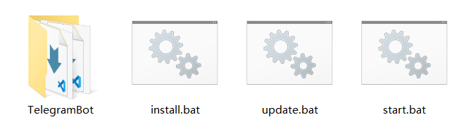

# Fool's Telegram Bot

[](https://www.python.org/downloads/)
[](https://docs.aiogram.dev/)
[](LICENSE)
[](pyproject.toml)
[](CHANGELOG.md)

> 一个基于 `Python` 和 `aiogram 3.x` 构建的异步 Telegram 机器人，采用模块化插件设计。
>
> **本项目仅限 `Windows` 用户使用。**
>
> ❗️ **v0.2.0 升级须知（破坏性变更）**：
> 请参考 **[🔄 更新版本](#-更新版本) -> 方式三：彻底重建**
> - **数据目录分离**：对话记录、帮助文档、渲染缓存及黑名单文件已迁移至 `data/` 目录，升级后首次运行会自动初始化，无需手动迁移。
> - **插件路径变更**：插件导入路径逻辑已修改，如有自定义插件需检查 `src/plugins` 目录结构。

---

## 📑 目录

- [✨ 功能特点](#-功能特点)
- [⚡ 自动化脚本](#-自动化脚本)
- [💬 关于 AI 对话](#-关于-ai-对话)
- [🛠️ 技术栈](#️-技术栈)
- [🖥️ 环境准备（`Windows` 用户必读）](#️-环境准备windows-用户必读)
- [快速开始](#-快速开始)
- [🔄 更新版本](#-更新版本)
- [💡 脚本提示信息翻译](#-脚本提示信息翻译)
  - [install.bat](#installbat)
  - [update.bat](#updatebat)
  - [start.bat](#startbat)
- [❗️ 温馨提示](#️-温馨提示)
- [📄 许可证 (`LICENSE`)](#-许可证-license)

---

## ✨ 功能特点

- **异步架构**: 基于 `asyncio` 和 `aiogram`，提供高并发处理能力。
- **插件化设计**: 功能模块位于 `src/plugins` 目录下，支持动态加载，易于扩展和维护。
- **完善日志**: 集成 `logging` 模块，支持控制台输出与文件 `Rotating` ，默认开启详细报错。
- **浏览器自动化**: 使用 `Playwright` 实现异步处理。
- **`TOML` 配置**: 使用 `config.toml` 进行集中式配置管理，类型安全且易读。
- **配置自动检测**: 每次启动机器人会自动检测是否更新了新配置项并提醒用户在 `config.toml` 中填写。
- **版本自动检测**: 每次启动机器人会自动检测是否有新版本。
- **Markdown 渲染服务**: 新增 `renderer.py`，统一处理 `Markdown` 转 `HTML`，支持 `Prism.js` 语法高亮脚本动态注入。
- **XSS 防御**: 引入 `bleach` 库对渲染后的 `HTML` 进行白名单清洗，仅放行安全标签和属性，防止恶意脚本注入。
- **动态字体度量**: 帮助命令的图片尺寸计算基于字体本身的数据（`Metrics`），而非硬编码，提升渲染适配性。
- **AI 黑名单缓存**: 新增内存缓存层读取 AI 黑名单，大幅减少高频对话时的磁盘 `I/O` 开销。

---

## ⚡ 自动化脚本

提供 `install.bat`、`update.bat` 和 `start.bat` 三个一键式脚本，请在项目的 [Releases 发布页面](../../releases) 下载最新版本。

- **脚本功能说明**
  - **`install.bat`（一键安装）**：自动克隆代码仓库、创建虚拟环境并安装项目所需的所有依赖。
  - **`update.bat`（一键更新）**：自动拉取仓库代码并同步依赖。
  - **`start.bat`（一键启动）**：自动激活虚拟环境，并通过 `Windows Terminal` 安全启动机器人。

  > **注意**：一键更新脚本 **不会** 自动检测是否已是最新版本，请仅在机器人给出有新版本提示时运行。

- **通用注意事项**
  - **路径要求**：整个路径中 **请勿包含中文或特殊字符**，以免引发环境报错。
  - **环境要求**：请参照 **[环境准备（Windows 用户必读）](#️-环境准备windows-用户必读)** 安装基础环境。若旧版本 `CMD` 出现问题，请尝试在 `Windows Terminal` 中执行脚本。
  - **停止机器人**：在弹出的终端窗口中按 **`Ctrl + C`** 即可安全停止服务，**不要 直接点 × 关闭控制台**。

- **目录规范**
  - **首次安装**：请将 `install.bat` 放在一个 **新建的空文件夹** 中双击运行，请确保路径下 **没有** 名为 `TelegramBot` 文件夹，脚本会自动创建 `TelegramBot` 项目文件夹。
  - **日常更新/启动**：请将 `update.bat` 或 `start.bat` 放在与 `TelegramBot` 文件夹 **同级的目录** 下双击运行。

- **脚本提示信息翻译**
  - 脚本所有提示信息均已添加序号，方便定位和排查问题。详见下方 **[ 💡 脚本提示信息翻译 ](#-脚本提示信息翻译)** 区域。



请 **严格** 按照参考图存放文件！！！

[⤴️ 返回目录](#-目录)

---

## 💬 关于 AI 对话

目前仅支持 **私聊** 使用

- **独立会话**：不同用户 **或** 不同群组中的同一用户，会话相互隔离

  > **注意**：群组中需触发关键词或 **@** 机器人 **（暂不可用）**

- **消息排队**：原子级别任务锁避免多任务并发出错
- **状态更新**：自动更新状态信息（排队中、思考中、思考完成内容），**计划** 加入取消排队按钮
- **自动引用**：状态信息引用原消息，回复内容引用思考过程
- **思考过程**：仅私聊输出，群组中请使用 `/history` 命令
- **取消会话**：若思考过程中用户删除原消息，停止处理该任务，消息不计入历史，**计划** 加入取消任务按钮

  > **注意**：该功能经测试，**目前** 只在 Nekogram 生效，原版 Telegram **不生效**，其他版本未测试

- **删除判断**：若用户删除机器人发出的状态信息，机器人会在必要时重新发送
- **超时处理**：配置超时时间和判断间隔，自动清除用户记录
- **其他功能**：
  - `Markdown` 文件历史记录
  - `Markdown` 格式回复
  - 个性化定制人设（**暂不可用**）
  - 自主开关对话功能
  - 更多参见 `/help` 命令

[⤴️ 返回目录](#-目录)

---

## 🛠️ 技术栈

| 组件 | 版本/描述 |
| :--- | :--- |
| **语言** | `Python 3.11+` |
| **核心框架** | [`aiogram 3.x`](https://docs.aiogram.dev/) |
| **依赖管理** | [`pyproject.toml`](pyproject.toml) |
| **代码规范** | [`ruff.toml`](ruff.toml) 独立配置，统一代码风格、导入排序及格式化 |
| **浏览器驱动** | `Playwright` / `chromium`（根据步骤下载） |
| **HTML 清洗** | `bleach`（XSS 防御白名单清洗） |
| **日志系统** | `logging`，强制静默第三方库噪音，增强自定义 `Logger` |

[⤴️ 返回目录](#-目录)

---

## 🖥️ 环境准备（`Windows` 用户必读）

本项目在控制台输出中大量使用了 Emoji 表情。传统的 `CMD` 或旧版 `PowerShell` 可能会导致 Emoji 显示为乱码或空白方块。
为了获得最佳的运行体验，**强烈建议安装并使用微软官方的 [`Windows Terminal`] + [`Git Bash`]**。

- **安装 `Windows Terminal`**

  请在 `Microsoft Store` 中搜索 `Windows Terminal` 并安装，或使用 `PowerShell` 安装：
   ```powershell
   winget install --id Microsoft.WindowsTerminal -e
   ```

- **安装 `Git for Windows`**

  前往 [`Git` 官网](https://git-scm.com) 下载并安装，安装时保持默认选项即可。
   > **重要提示**：如果安装后仍提示没有 `Git` 环境，请尝试重启，如果仍未解决，自行询问 **AI 工具** 如何将 `git` 加入 **环境变量**

- **设置默认终端**：
  - 打开 `Windows Terminal`（可在开始菜单搜索 **终端**，或按 `Win + R` 输入 `wt` 并回车）。
  - 点击标签栏右侧的 **下拉箭头**，选择 **设置**。
  - 在左侧选择 **启动**，将“默认配置文件”设置为 `Windows PowerShell`。
  - 点击右下角的 **保存**，后续所有命令均在此环境中执行。

[⤴️ 返回目录](#-目录)

---

## 快速开始

- **极速体验（推荐）**
  - 阅读 **[⚡ 自动化脚本](#-自动化脚本)** 章节说明
  - 双击运行 `install.bat`，自动完成安装。
  - 双击运行 `start.bat`，生成 `config.toml` 文件。
  - 手动编辑 `config.toml` 填入你的 `Token` 和 `API` 配置。
  - **（可选）** 根据注释按需编辑 `config.toml` 其他配置。
  - 再次双击运行 `start.bat`，启动机器人，即可开始体验。

- **备选方案**
  <details>
  <summary>️手动安装指南（点击展开）</summary>

  如果你遇到了脚本报错，或者想深入了解项目的配置过程，请参考以下手动步骤：

  **1. 克隆项目**
  ```powershell
  git clone https://github.com/lym2006/TelegramBot.git
  cd TelegramBot
  ```

  **2. 创建虚拟环境**
  ```powershell
  python -m venv .venv
  .\.venv\Scripts\Activate.ps1
  ```

  **3. 安装依赖**
  本项目使用 `pyproject.toml` 管理依赖，推荐使用以下命令安装：
  ```powershell
  python -m pip install --upgrade pip
  python -m pip install -e .
  # 如果你在中国大陆，网络较慢，可以使用国内镜像源：
  # pip install -e . -i https://pypi.tuna.tsinghua.edu.cn/simple
  # （可选）如果有开发需求，可以安装开发依，用于代码规范检查（Ruff）
  # pip install -e ".[dev]" -i https://pypi.tuna.tsinghua.edu.cn/simple
  ```

  **4. 配置项目**
  编辑 `config.toml` 文件，根据注释填入你的配置：
  - **`Token`、机器人名称**：在 [`BotFather`](https://t.me/BotFather) 对话获取、设置。
  - **`API`、模型名称**：在 [硅基流动模型广场](https://cloud.siliconflow.cn/me/models) 获取。

  **5. 准备 Chrome 环境**
  本项目使用 `Playwright` 实现浏览器自动化操作，可自动下载依赖文件。
  ```powershell
  # 1. 如果在国内网络环境下，建议先配置镜像源
  $env:PLAYWRIGHT_DOWNLOAD_HOST="https://npmmirror.com/mirrors/playwright"

  # 2. 安装 Chromium
  python -m playwright install chromium
  ```

  **6. 运行机器人**
  ```powershell
  python -m bot
  ```

  </details>

[⤴️ 返回目录](#-目录)

---

## 🔄 更新版本

当项目发布新版本时，你可以通过以下方式同步最新代码和依赖：

| 方式 | 适用场景 | 操作说明 |
| :--- | :--- | :--- |
| **方式一：一键脚本（推荐）** | 日常更新 | 直接双击运行 `update.bat` |
| **方式二：手动更新** | 少量改动 | 在 `TelegramBot` 目录下执行 `git pull origin main`，然后执行 `pip install -e .` 同步依赖 |
| **方式三：彻底重建** | 重大架构更新 | 执行 **重建环境的 `Powershell` 命令** |

> **重建环境的 `PowerShell` 命令参考**：
> ```powershell
> Remove-Item -Recurse -Force .venv
> python -m venv .venv
> .venv\Scripts\activate
> ```
>
> 若无法完成更新，可选择在备份 `data/` 目录、`config.toml`配置、自定义插件以及其他重要内容后，删除整个 `TelegramBot` 项目文件夹，再重新安装。

[⤴️返回目录](#-目录)

---

## 💡 脚本提示信息翻译

### install.bat

| # | English Prompt | 中文翻译 |
|---|---------------|---------|
| [01] | Checking Python installation... | 正在检查 Python 安装... |
| [02] | [ERROR] Python not found! | [错误] 未检测到 Python 环境！ |
| [03] | Please download and install Python 3.11+ from: | 请从以下地址下载并安装 Python 3.11+： |
| [04] | https://www.python.org/downloads/ | https://www.python.org/downloads/ |
| [05] | Checking Git installation... | 正在检查 Git 安装... |
| [06] | [ERROR] Git not found! | [错误] 未检测到 Git 环境！ |
| [07] | Please download and install Git for Windows from: | 请从以下地址下载并安装 Git for Windows： |
| [08] | https://git-scm.com/download/win | https://git-scm.com/download/win |
| [09] | Checking project directory... | 正在检查项目目录... |
| [10] | [INFO] TelegramBot directory already exists, skipping clone. | [信息] 已检测到 TelegramBot 目录，跳过克隆步骤。 |
| [11] | Cloning project from GitHub... | 正在从 GitHub 克隆项目... |
| [12] | [ERROR] Git clone failed! Please check your network connection. | [错误] Git 克隆失败！请检查网络连接。 |
| [13] | Checking virtual environment... | 正在检查虚拟环境... |
| [14] | [INFO] Old virtual environment found, cleaning up... | [信息] 检测到旧的虚拟环境，正在清理... |
| [15] | Creating virtual environment... | 正在创建虚拟环境... |
| [16] | [ERROR] Failed to create virtual environment! | [错误] 创建虚拟环境失败！ |
| [17] | Activating environment and upgrading pip... | 正在激活环境并升级 pip... |
| [18] | Installing project dependencies... | 正在安装项目依赖... |
| [19] | [ERROR] Failed to install dependencies! Please check network or disk space. | [错误] 依赖安装失败！请检查网络连接或磁盘空间。 |
| [20] | Downloading Chromium browser component... | 正在下载 Chromium 浏览器组件... |
| [21] | Installation Completed! | 安装完成！ |
| [22] | [IMPORTANT] Please edit config.toml to fill in your Token and API keys! | [重要] 请编辑 config.toml 填入你的 Token 和 API 配置！ |

### update.bat

| # | English Prompt | 中文翻译 |
|---|---------------|---------|
| [01] | Locating project directory... | 正在定位项目目录... |
| [02] | [ERROR] TelegramBot directory not found! | [错误] 未找到 TelegramBot 目录！ |
| [03] | Please make sure you have cloned the code into the TelegramBot folder, | 请确保已将代码克隆到 TelegramBot 文件夹中， |
| [04] | and the update script is in the same directory as the TelegramBot folder. | 并且更新脚本与 TelegramBot 文件夹位于同级目录下。 |
| [05] | Checking Git installation... | 正在检查 Git 安装... |
| [06] | [ERROR] Git not found! Please install Git for Windows first. | [错误] 未检测到 Git 环境！请先安装 Git for Windows。 |
| [07] | Checking Git repository... | 正在检查 Git 仓库... |
| [08] | [ERROR] Current directory is not a Git repository! | [错误] 当前目录不是 Git 仓库！ |
| [09] | Please make sure you installed via install.bat, or manually ran git clone. | 请确保通过 install.bat 安装过，或手动执行过 git clone。 |
| [10] | Activating virtual environment... | 正在激活虚拟环境... |
| [11] | [ERROR] Virtual environment not found! Please run install.bat first. | [错误] 未找到虚拟环境！请先运行 install.bat。 |
| [12] | Pulling latest code from GitHub... | 正在从 Github 拉取最新代码... |
| [13] | [WARNING] Code pull failed! Please check your network connection or if there are conflicts. | [警告] 代码拉取失败！请检查你的网络连接或是否存在冲突 |
| [14] | [TIP] If there are conflicts, please resolve them manually and run this script again. | [提示] 如果存在冲突，请手动解决后重新运行本脚本。 |
| [15] | Syncing project dependencies... | 正在同步项目依赖... |
| [16] | Update Completed! | 更新完成！ |

### start.bat

| # | English Prompt | 中文翻译 |
|---|---------------|---------|
| [01] | [ERROR] Project folder TelegramBot not found! | [错误] 未找到项目文件夹 TelegramBot！ |
| [02] | Please ensure start.bat and the TelegramBot folder are in the same directory. | 请确保 start.bat 和 TelegramBot 文件夹在同一级目录。 |
| [03] | [INFO] Windows Terminal detected. Launching gracefully... | [信息] 检测到 Windows Terminal，正在优雅启动... |
| [04] | [INFO] Windows Terminal not found. Falling back to CMD compatibility mode... | [信息] 未检测到 Windows Terminal，正在降级为 CMD 兼容模式启动... |

[⤴️返回目录](#-目录)

---

## ❗️ 温馨提示

本项目目前仍处于 **测试阶段**，如遇报错或异常行为属正常现象，请勿惊慌 😊 

如需进行插件开发、查阅 API 或查看源码，请参考以下资源：
- 📖 **官方文档**：[`aiogram.dev`](https://docs.aiogram.dev/en/latest/)
- 💻 **`GitHub` 仓库**：[`aiogram`](https://github.com/aiogram/aiogram)

[⤴️ 返回目录](#-目录)

---

## 📄 许可证 (`LICENSE`)

本项目采用 MIT 许可证 - 查看 [`LICENSE`](LICENSE) 文件了解详情。

---
Made by **lym2006**
